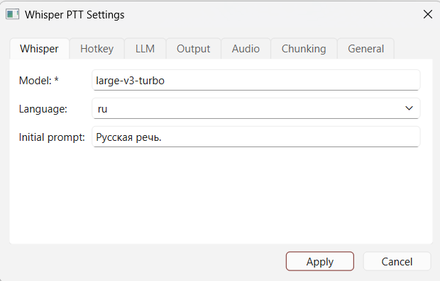
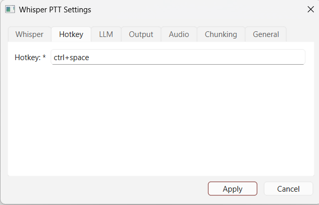
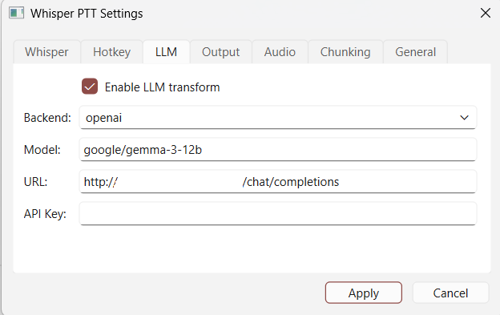
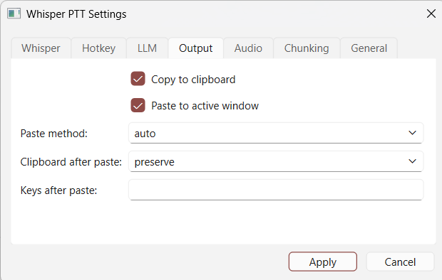
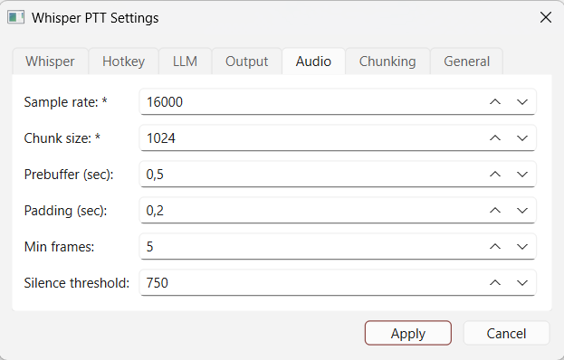
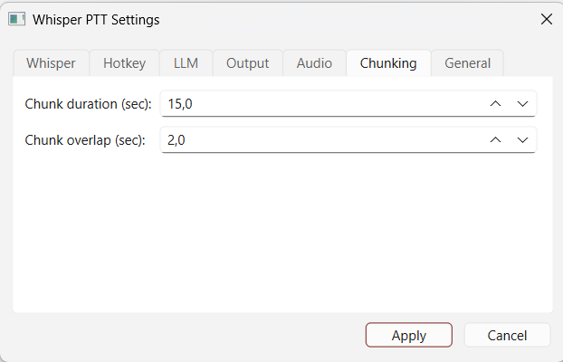
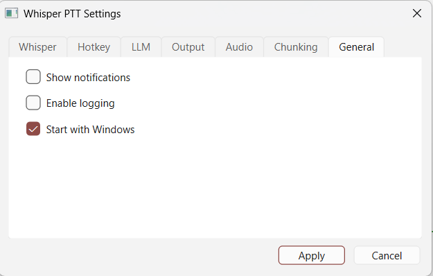

# Whisper-PTT

**Local Push-to-Talk Voice-to-Text + AI Spell Checker** with system tray GUI, recording overlay, and LLM post-processing. Fully offline - nothing leaves your machine.

Two modes in one app:
- **Voice-to-text** - hold a hotkey, speak, release. Transcribed text is pasted into the active window.
- **SpellCheck** - select text, press hotkey. LLM fixes grammar and typos, pastes corrected text back.

A local LLM (Ollama, LM Studio, or any OpenAI-compatible server) powers both STT post-processing and spell checking.

> Based on [sancau/whisper_ptt](https://github.com/sancau/whisper_ptt). This project has diverged significantly with a GUI, chunked transcription, multi-backend LLM support, and many other features.

<p align="center"></p>

---

## Features

- **System tray GUI** (PySide6) - tray icon, recording overlay with waveform, settings dialog
- **Push-to-talk** - hold hotkey to record, release to transcribe and paste
- **SpellCheck** - select text, press hotkey, LLM fixes grammar/typos and pastes back (Windows)
- **GPU-accelerated Whisper** - NVIDIA CUDA (faster-whisper) or Apple Silicon (mlx-whisper)
- **Chunked transcription** - long recordings split into overlapping chunks for better accuracy
- **LLM post-processing** - Ollama or OpenAI-compatible backends (LM Studio, llama.cpp, etc.)
- **Smart paste** - auto-detect terminals, configurable paste method and keys after paste
- **Windows autostart** - launch at login with startup delay for reliable hotkey registration
- **Single instance** - prevents duplicate processes
- **Logging** - optional file logging for diagnostics
- **Microphone selection** - choose input device from GUI (hot-swap without restart), auto-detects system default device changes
- **Fully configurable** - all settings via `.env` file or GUI settings dialog

---

## Platforms

GPU acceleration is required - no CPU-only mode. One self-contained script per platform:

| Platform | Script | Whisper backend | Accelerator |
|----------|--------|-----------------|-------------|
| Windows / Linux | `whisper_ptt_cuda.py` | [faster-whisper](https://github.com/SYSTRAN/faster-whisper) | NVIDIA CUDA |
| macOS | `whisper_ptt_apple_silicon.py` | [mlx-whisper](https://github.com/ml-explore/mlx-examples/tree/main/whisper) | Apple Silicon (Metal) |

---

## Quick start

### Windows / Linux (NVIDIA CUDA)

```bash
git clone https://github.com/Desko77/whisper_ptt.git
cd whisper_ptt
python -m venv venv
source venv/bin/activate   # Windows: venv\Scripts\activate
pip install -r requirements-cuda.txt
cp .env.example-cuda .env       # edit as needed
```

**GUI mode** (recommended on Windows):
```bash
pythonw whisper_ptt_gui.py
# or use run_gui.bat
```

**Console mode**:
```bash
python whisper_ptt_cuda.py
```

On Linux, the `keyboard` library needs root for global hotkeys: `sudo python whisper_ptt_cuda.py`.

### macOS (Apple Silicon)

```bash
git clone https://github.com/Desko77/whisper_ptt.git
cd whisper_ptt
python -m venv venv
source venv/bin/activate
pip install -r requirements-apple-silicon.txt
cp .env.example-apple-silicon .env   # edit as needed
python whisper_ptt_apple_silicon.py
```

macOS will prompt for **Accessibility** and **Input Monitoring** permissions on first run. Grant those and run **without** `sudo`. The Whisper model is downloaded from HuggingFace on first launch.

### LLM transform (optional, off by default)

Supports two backends for LLM post-processing:

- **Ollama** - native Ollama API
- **OpenAI-compatible** - LM Studio, llama.cpp server, or any OpenAI-compatible endpoint

```bash
# Option 1: Ollama
ollama pull gemma3:12b

# Option 2: LM Studio - download a model via LM Studio UI, start the server
```

Set `WHISPER_PTT_USE_LLM_TRANSFORM=true` and configure the backend in `.env`:

```bash
# Ollama (default)
WHISPER_PTT_LLM_BACKEND=ollama
WHISPER_PTT_LLM_MODEL=gemma3:12b
WHISPER_PTT_LLM_URL=http://localhost:11434/api/generate

# OpenAI-compatible (LM Studio, llama.cpp, etc.)
WHISPER_PTT_LLM_BACKEND=openai
WHISPER_PTT_LLM_MODEL=google/gemma-3-12b
WHISPER_PTT_LLM_URL=http://localhost:1234/v1/chat/completions
```

The default prompt cleans up grammar and filler words. A separate Russian prompt is used automatically when `WHISPER_LANGUAGE=ru`. Replace via `WHISPER_PTT_LLM_TRANSFORM_PROMPT` to translate, reformat, or do anything else.

---

## GUI

The GUI runs as a system tray application with:

- **Tray icon** - changes color based on state (blue=loading, green=ready, red=recording, orange=processing)
- **Recording overlay** - translucent waveform indicator, draggable
- **Settings dialog** - all configuration in one place, organized by category
- **Notifications** - balloon notifications with transcribed text
- **Autostart** - "Start with Windows" option in settings
- **Re-register hotkeys** - tray menu option if hotkeys stop working

### Settings dialog

| | |
|---|---|
|  |  |
| **Whisper** - model, language, initial prompt | **Hotkey** - push-to-talk key |
|  |  |
| **LLM** - backend, model, URL, API key | **Output** - clipboard, paste method, keys after paste |
|  |  |
| **Audio** - microphone, sample rate, chunk size, prebuffer, silence threshold | **Chunking** - chunk duration and overlap for long recordings |
|  | |
| **General** - notifications, logging, autostart | |

---

## Configuration

All settings are read from `WHISPER_PTT_*` environment variables, a `.env` file, or the GUI settings dialog. Both scripts use the same variable names.

| Variable | Description | Default |
|----------|-------------|---------|
| `WHISPER_PTT_WHISPER_MODEL` | Whisper model (`tiny`, `base`, `small`, `medium`, `large-v3`, `large-v3-turbo`) | `large-v3` / `large-v3-turbo` |
| `WHISPER_PTT_WHISPER_LANGUAGE` | Language code (`en`, `ru`, `de`, `fr`, ...) | `en` |
| `WHISPER_PTT_HOTKEY` | Hold-to-record key. Combos like `alt+f12` work. | `alt` / `option` |
| `WHISPER_PTT_USE_LLM_TRANSFORM` | Enable LLM transform | `false` |
| `WHISPER_PTT_LLM_BACKEND` | LLM backend: `ollama` or `openai` (LM Studio, llama.cpp) | `ollama` |
| `WHISPER_PTT_LLM_MODEL` | LLM model name | `gemma3:12b` |
| `WHISPER_PTT_LLM_URL` | LLM API URL | auto by backend |
| `WHISPER_PTT_AUDIO_DEVICE` | Microphone: `default` or device name substring (e.g. `Realtek`) | `default` |
| `WHISPER_PTT_COPY_TO_CLIPBOARD` | Copy result to clipboard | `true` |
| `WHISPER_PTT_PASTE_TO_ACTIVE_WINDOW` | Paste into focused window | `true` |
| `WHISPER_PTT_PASTE_METHOD` | Paste method: `auto`, `ctrl+v`, `ctrl+shift+v`, `shift+insert` | `auto` |
| `WHISPER_PTT_CLIPBOARD_AFTER_PASTE_POLICY` | After paste: `restore`, `clear`, or `preserve` | `restore` |
| `WHISPER_PTT_KEYS_AFTER_PASTE` | Key(s) to send after paste (`enter`, `ctrl+enter`, `none`) | `enter` |
| `WHISPER_PTT_CHUNK_DURATION_SEC` | Chunk duration for long recordings (0 = disabled) | `15` |
| `WHISPER_PTT_CHUNK_OVERLAP_SEC` | Overlap between chunks | `2.0` |
| `WHISPER_PTT_SPELLCHECK_ENABLED` | Enable SpellCheck feature (Windows) | `true` |
| `WHISPER_PTT_SPELLCHECK_HOTKEY` | SpellCheck hotkey | `ctrl+t` |
| `WHISPER_PTT_SPELLCHECK_LANGUAGE` | SpellCheck language detection: `auto`, `ru`, `en` | `auto` |
| `WHISPER_PTT_SPELLCHECK_CLEAN_PROFANITY` | Replace profanity with neutral equivalents | `true` |

<details>
<summary>Advanced settings</summary>

| Variable | Description | Default |
|----------|-------------|---------|
| `WHISPER_PTT_WHISPER_INITIAL_PROMPT` | Whisper initial prompt (language hint) | `English speech.` |
| `WHISPER_PTT_LLM_API_KEY` | API key for OpenAI-compatible servers (if required) | - |
| `WHISPER_PTT_LLM_TRANSFORM_PROMPT` | Custom LLM prompt (`{detected_lang}`, `{raw_text}` placeholders) | built-in |
| `WHISPER_PTT_SAMPLE_RATE` | Audio sample rate (Hz) | `16000` |
| `WHISPER_PTT_CHUNK_SIZE` | Audio chunk size | `1024` |
| `WHISPER_PTT_PREBUFFER_SEC` | Prebuffer duration (captures the first word) | `0.5` |
| `WHISPER_PTT_PADDING_SEC` | Silence padding before transcription | `0.2` |
| `WHISPER_PTT_MIN_FRAMES` | Min frames to process (skip accidental taps) | `5` |
| `WHISPER_PTT_SILENCE_AMPLITUDE` | Amplitude below which audio is treated as silence | `750` |
| `WHISPER_PTT_LOG_ENABLED` | Enable file logging | `false` |
| `WHISPER_PTT_LOG_FILE` | Log file path | `whisper_ptt.log` |
| `WHISPER_PTT_SHOW_NOTIFICATIONS` | Show balloon notifications | `true` |

</details>

---

## Usage

### Voice-to-text

Default hotkey: **Alt** (Windows/Linux) or **Option** (macOS). Hold to record, release to transcribe. Exit with Ctrl+C (console) or Quit from tray menu (GUI). The defaults are convenient but can interfere with other shortcuts - consider remapping to `pause` or a combo like `ctrl+space` via `WHISPER_PTT_HOTKEY`.

With LLM transform enabled, the raw transcription is passed through the LLM before pasting. What the LLM does is entirely controlled by the prompt - grammar cleanup, email formatting, translation, or any other text transformation.

### SpellCheck (Windows only)

Select text in any window, press **Ctrl+T** (default). The selected text is captured via Ctrl+C, sent to the LLM for grammar/typo correction, and the fixed text is pasted back. The original clipboard is preserved.

- Uses the same LLM backend and model as voice-to-text
- Auto-detects language (Russian/English) or can be forced via config
- Built-in prompts forbid rephrasing - only minimal fixes (punctuation, typos, capitalization)
- Technical terms, URLs, and code snippets are preserved
- Optional profanity filter - replaces obscene language with neutral equivalents (on by default)

Configure via `.env` or GUI (SpellCheck tab):
```bash
WHISPER_PTT_SPELLCHECK_ENABLED=true
WHISPER_PTT_SPELLCHECK_HOTKEY=ctrl+t
WHISPER_PTT_SPELLCHECK_LANGUAGE=auto            # auto, ru, en
WHISPER_PTT_SPELLCHECK_CLEAN_PROFANITY=true     # replace profanity with neutral text
```

---

## License

MIT - see [LICENSE](LICENSE).

Based on [whisper_ptt](https://github.com/sancau/whisper_ptt) by Alexander Tatchin.
